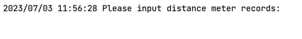
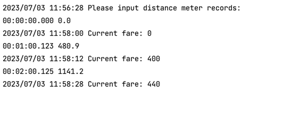
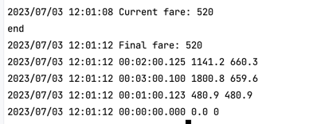

# Taxi Fare

## Requirements

- Go version >= 1.20

## Assumption

- On the task not stated when the program will stop, so I assume that the program will stop when the input send `end`


## Running program

run this command for downloading the dependencies

```shell
go mod download
```

after that run the app using this command

```shell
go run github.com/mariojuzar/taxi-fare
```

or you can build the source code first and then run the binary

```shell
go build -a github.com/mariojuzar/taxi-fare
```


## Run Test

run unit test code with this command

```shell
go test -cover -count=1 -failfast ./...
```


## Program Instruction

When running the program it will ask you to input the distance meter value


Then you will need to input the value, and pressing enter will run the calculation and give current fare result



Type `end` to stop receiving value and calculate final fare and show distances.
